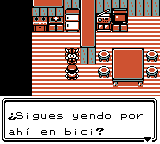
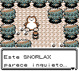
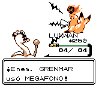
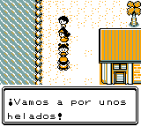

# Pokémon Super Oro 97 (Edición Oro Spaceworld 1997)

> Estamos en Kyoto, Japón, faltan pocas semanas para que el año cambie de digito y demos la bienvenida a 1998. El pasado noviembre nos quedamos con ganas de más tras poder jugar a la anticipada secuela de Pokémon Edición Roja y Azul en la feria <b>Spaceworld</b> que organizó Nintendo.
> 
> 
> 
> Y hoy, por fin, <b>Pokémon Edición Oro</b> llega a las tiendas de todo el país.
> 
> — Autor desconocido, Diciembre 1997

## ¡El Profesor Oak te convoca para visitarle en su nuevo laboratorio! ¿Qué sorpresas te aguardan al llegar?

 

<b>¡Explora Nihon montado en tu nuevo monopatín!</b> ¡Un mundo nuevo en el que capturar, entrenar y luchar con nuevos Pokémon! Consigue el nuevo PokéGear, que incluye un mapa, una radio, un teléfono móvil y un reloj. ¡Pon tu reloj en hora y verás como anochece! ¡Todo ocurre en tiempo real!

- ¡Decenas de nuevos Pokémon! Busca las nuevas evoluciones de los más conocidos, descubre especies totalmente nuevas y... *¡Hazte con todos!*
- Nuevos líderes de gimnasio a los que te enfrentarás para ganar ocho nuevas medallas.
- ¡Dos nuevos tipos de Pokémon: Siniestro y Acero!
- ¡Detén al Team Rocket e impide que tomen control sobre los Pokémon!
- ¡Descubre el minijuego secreto de Pikachu! 

## Descarga

Para instalar el repositorio, consulta [INSTALL.md](INSTALL.md).

Compila la siguiente ROM:

* pokegold97-es.gbc  `md5: a9a9379abdc82e28e13ba2cc5f7eeedb`

Si no puedes compilar el repositorio por ti mismo, puedes descargar este parche IPS y aplicarlo a una ROM limpia con una herramienta como [Flips](https://github.com/Alcaro/Flips).

* [**pokegold97-es_v1.0.0.ips**](patches/pokegold97-es_v1.0.0.ips): aplicar a Pokemon - Edicion Oro (Spain) (SGB Enhanced) (GB Compatible).gbc `md5: 9462bc81907e38c59acccd739690e6f9`

***Última actualización: 11 de febrero de 2023***

## ¡Guía maestra disponible! (en inglés)

- [**Discord**][discord]: Únete al servidor de la versión en inglés para acceder a un PDF de 300 páginas que contiene una guía completa, la Pokédex y todo tipo de información sobre Super Oro 97.
- **Mapas** (versión en español): [Nihon](images/mapa_nihon.jpg) / [Islas Ponientes](images/mapa_islas_ponientes.jpg).

## Ver también

Cambios respecto a la traducción oficial de Oro y Plata: [translation_notes.md](translation_notes.md). 
Changelog de la versión en español: [changelog-es.md](changelog-es.md). 
Créditos: [credits.txt](credits.txt).

Si encuentras algún bug, problema en el juego o error en la traducción, puedes reportarlo en [Issues](https://github.com/erosunica/Gold97SGB-es/issues).

## Capturas de pantalla

---

Proyectos indispensables para crear la versión en español:

- [Pokémon Super Gold 97][Gold97SGB]
- [Pokémon Gold and Silver][pokegold]
- [Pokémon Crystal i18n][pokecrystal]

[Gold97SGB]: https://github.com/lvl-3-g/Gold97SGB
[pokegold]: https://github.com/pret/pokegold
[pokecrystal]: https://github.com/mid-kid/pokecrystal/tree/i18n
[discord]: https://discord.gg/k6nt5SwGhw
